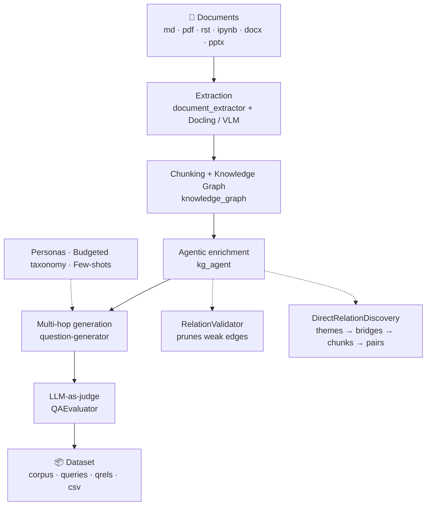

<div align="center">

# STARK

**Synthetic Training And RAG Knowledge**

A synthetic **multi-hop** Q/A dataset generator for evaluating and fine-tuning RAG systems.
Point it at your technical documentation — get back an annotated, scored, ready-to-use benchmark.

[](https://www.python.org/)
[](https://github.com/explodinggradients/ragas)
[](https://fastapi.tiangolo.com/)
[](https://streamlit.io/)
[](https://github.com/DS4SD/docling)
[](#-what-stark-produces)
[](LICENSE)

**English** · [Français](README.md)

[Quick start](#-quick-start) · [How it works](#-how-it-works) · [Configuration](#-configuration) · [Outputs](#-what-stark-produces) · [Documentation](#-documentation)

</div>

---

## The problem

Evaluating a RAG system requires a ground-truth question/answer set. But:

- public datasets don't cover **your** domain;
- hand-annotating costs days of expert time;
- naive generators produce **single-chunk** questions that a plain `grep` could answer — so they measure nothing about the system's ability to reason.

## What STARK does

STARK builds a **knowledge graph** over your corpus (nodes = chunks, edges = semantic relations), then only generates questions from **genuinely connected chunk pairs**. Every question therefore requires two reasoning hops — and an LLM judge afterwards verifies it isn't answerable from a single context.

```
❌ Naive generator   "What does the extend_3d method do?"           → 1 chunk is enough
✅ STARK             "Which aerodynamic data must be available      → 2 chunks required
                      before calling extend_3d, and why does the
                      mode differ between rotor and stator?"
```

---

## ✨ Key features

| | |
|---|---|
| 🕸️ **Graph-driven generation** | Chunking that respects headings and fenced code blocks; `cosine`, `shared_keyphrase`, `next_chunk` and `same_document` relations |
| 🤖 **Agentic KG enrichment** | A `RelationValidator` prunes weak edges; a 4-agent pipeline discovers **cross-document** bridges that similarity alone misses — without an O(n²) sweep |
| ⚖️ **Built-in LLM judge** | Every Q/A pair is scored on 3 criteria (*groundedness*, *accuracy*, *two-hop necessity*) via `logprobs`, with a configurable rejection threshold |
| 🎭 **Personas & budgeted taxonomy** | Question types follow a target budget (30% integration, 20% comparison…) — no more skewed datasets |
| 🧠 **Agent auto-configuration** | Describe your corpus in three lines: an 8-step LLM agent builds the taxonomy, personas, every prompt and the few-shot examples |
| 📦 **Standard outputs** | BEIR (`corpus` / `queries` / `qrels`) + inspection CSV + serialized KG |
| 💾 **Crash-safe resume** | Checkpointed after every question: an interrupted run picks up where it stopped |
| 🔬 **One-command ablation** | `make compare` runs 4 configurations and measures what each tool actually contributes |
| 🖥️ **CLI, API and UI** | A command-line runner, a FastAPI REST API and a Streamlit interface over the same core |

---

## 🔭 How it works



Every stage is driven by a **`PipelineConfig`**: a single YAML file per session holding the prompts, personas, taxonomy, scoring thresholds and chunking parameters. No prompt is hard-coded.

---

## 🚀 Quick start

### 1. Install

```bash
git clone https://github.com/Ibrahim-bel/stark.git
cd stark
pip install -r requirements.txt      # or: make install
```

> Python ≥ 3.10 recommended. The install pulls in `torch` and the Docling models — plan for disk space and use a dedicated virtual environment.

### 2. Configure

```bash
cp .env.example .env
```

The bare minimum in `.env`:

```bash
OPENAI_API_KEY=sk-...
OPENAI_BASE_URL=https://api.openai.com/v1   # or your own proxy / compatible endpoint
OPENAI_MODEL=gpt-4o                          # generation model
SCORING_MODEL=gpt-4.1-mini                   # ⚠️ must support logprobs → a GPT model
EMBEDDING_API_KEY=sk-...
EMBEDDING_BASE_URL=https://api.openai.com/v1
EMBEDDING_MODEL=text-embedding-3-small
INPUT_DIR=./docs                             # your corpus
OUTPUT_DIR=./src/output/my_run               # where the dataset lands
```

### 3. Bring your corpus

`docs/` is not version-controlled: drop your own documents in it (or point `INPUT_DIR` elsewhere).

```bash
mkdir -p docs && cp -r /path/to/my_docs/*.md docs/
```

### 4. First run

```bash
make run-dry          # ⏱️ 2-question smoke test — validates the config end to end
make run N=50         # real generation
```

The dataset lands in `OUTPUT_DIR`. Open `dataset.csv` for an immediate human read.

---

## 🛠️ Three ways to run it

<table>
<tr><th>Mode</th><th>For</th><th>Command</th></tr>
<tr>
<td><b>CLI</b></td>
<td>Reproducible runs, CI, batch jobs</td>
<td><code>make run N=100</code></td>
</tr>
<tr>
<td><b>REST API</b></td>
<td>Integrating into your own tooling</td>
<td><code>make server</code> → <code>:8080</code></td>
</tr>
<tr>
<td><b>Web UI</b></td>
<td>Exploring, reviewing Q/A, editing prompts</td>
<td><code>make stark</code> → <code>:8501</code></td>
</tr>
</table>

### Every CLI command

```bash
make run                     # run per pipeline/cosapp_v1.yaml (N=10 by default)
make run N=100               # override the question count
make run-dry                 # quick test, 2 questions
make run EXTRA="--no-discover --input-dir ./my_docs"
make compare N=50            # 4 ablation runs (see below)
make server                  # FastAPI  — port 8080
make stark                   # Streamlit UI — port 8501
```

Configuration precedence: **CLI flags > `cosapp_v1.yaml` > `.env` > built-in defaults**.

### REST API (excerpt)

| Method | Route | Description |
|---|---|---|
| `POST` | `/api/sessions` | Create a session |
| `POST` | `/api/sessions/{id}/auto-configure` | Build the config with the LLM agent |
| `POST` | `/api/sessions/{id}/dry-run` | Validate the config (2 triplets) |
| `POST` | `/api/sessions/{id}/generate` | Start a generation job |
| `GET` | `/api/sessions/{id}/jobs/{job_id}` | Track progress (`stage`, `pct`) |
| `GET` | `/api/sessions/{id}/results/{job_id}` | Download the dataset |

→ Full list in [PIPELINE.md § 14](PIPELINE.md) (French).

---

## 🔧 Configuration

A session is one YAML file. [`pipeline/cosapp_v1.yaml`](pipeline/cosapp_v1.yaml) is a complete worked example and reference.

### Toggle tools on and off

```yaml
tools:
  vlm: false                  # visual PDF extraction (vision model)
  cosine_relations: false     # cosine-similarity relations
  keyphrase_relations: false  # shared-keyphrase relations
  validate_relations: true    # KG Agent — prune weak relations
  discover_relations: true    # KG Agent — new cross-document relations
  qa_eval: false              # LLM-as-judge
  dry_run: false              # test mode, 2 questions
```

### Narrow the generation

```yaml
filters:                      # null = use everything
  taxonomy: [implementation, comparison]
  personas: ["CoSApp Developer"]
  lengths:  [long, medium]    # long | medium | short
  styles:   [perfect_grammar] # perfect_grammar | web_search_like | misspelled | poor_grammar
```

### Budgeted taxonomy

The budget is what keeps the dataset diverse: for each question STARK picks the most **under-represented** type among those compatible with the chunk pair.

| Type | Budget | What the question asks for |
|---|---:|---|
| `integration` | 30% | How two elements interact (data flow, ports, equations) |
| `comparison` | 20% | What separates two classes, modes or approaches |
| `design_rationale` | 20% | **Why** a design decision was made |
| `implementation` | 15% | **How** to use or configure something, across both segments |
| `enumeration` | 10% | A list of steps, ports or conditions assembled from both |
| `factual` | 5% | A value, type or name only determinable by combining both |

> The budget must sum to `1.0` — validated by Pydantic on load, and renormalized automatically when a filter narrows the taxonomy.

### Auto-configuration

Don't feel like writing 900 lines of YAML? Describe your corpus in the UI (or via `POST /auto-configure`): an 8-step LLM agent analyses the corpus, designs the taxonomy, invents the personas, writes every prompt, generates the few-shot examples, then validates the whole thing. Budget 3–5 minutes in quality mode.

---

## 📦 What STARK produces

```
OUTPUT_DIR/
├── dataset.json                  # full dataset + provenance (tools_used, filters_used)
├── corpus.jsonl                  # BEIR — the source chunks
├── queries.jsonl                 # BEIR — the questions
├── qrels.jsonl                   # BEIR — question → relevant chunks
├── dataset.csv                   # tabular view for human inspection
├── knowledge_graph.json          # serialized KG (nodes, edges, embeddings)
└── questions_checkpoint.json     # resume point after an interruption
```

**`dataset.csv`** — one row per question, with both contexts, its type, its persona and its scores:

| `question` | `answer` | `context_1` | `context_2` | `question_type` | `persona` | `qa_groundedness` | `qa_accuracy` | `qa_two_hop` | `qa_overall` |
|---|---|---|---|---|---|---|---|---|---|

The BEIR triple plugs straight into existing RAG evaluators (RAGAS, BEIR, `ir_datasets`…).

---

## 🔬 Measuring what each tool is worth

Every stage of the pipeline costs tokens. STARK lets you check it earns them:

```bash
make compare N=50
```

| Run | `validate` | `discover` | `qa_eval` | Output |
|---|:--:|:--:|:--:|---|
| `run_base` | ✗ | ✗ | ✗ | `src/output/compare/run_base/` |
| `run_validate` | ✓ | ✗ | ✗ | `src/output/compare/run_validate/` |
| `run_discover` | ✗ | ✓ | ✗ | `src/output/compare/run_discover/` |
| `run_full` | ✓ | ✓ | ✓ | `src/output/compare/run_full/` |

Compare the resulting `dataset.csv` files to make the cost/quality call on **your** corpus.

---

## 📁 Repository layout

```
stark/
├── pipeline/
│   ├── main.py                 # CLI runner — entry point
│   ├── cosapp_v1.yaml          # full session config + tools/filters
│   ├── base/                   # re-exports of always-on components
│   └── tools/                  # re-exports of optional components
│
├── src/
│   ├── pipeline_config.py      # Pydantic v2 schema for the whole configuration
│   ├── config_agent.py         # 8-step LLM auto-configuration agent
│   ├── document_extractor.py   # extraction (+ docling_client, document_preprocessor)
│   ├── knowledge_graph.py      # chunking + KG construction
│   ├── kg_agent.py             # RelationValidator + DirectRelationDiscovery
│   ├── question-generator.py   # multi-hop synthesis + QAEvaluator
│   ├── question_type_budget.py # question-type budget allocation
│   ├── personas.py             # default personas
│   ├── session_manager.py      # session YAML CRUD
│   ├── job_runner.py           # async job orchestration
│   ├── server.py               # FastAPI API
│   └── stark_app.py            # Streamlit interface
│
├── docs/                       # your corpus (not version-controlled)
└── tests/                      # pytest suite
```

---

## 🧪 Tests

```bash
pytest                 # full suite
pytest -v              # verbose
pytest tests/test_split_generation.py
```

---

## 📚 Documentation

| Document | Contents |
|---|---|
| **[PIPELINE.md](PIPELINE.md)** | The pipeline step by step: algorithms, prompts, output formats, API, UI |
| **[STARK_PIPELINE_AGENT.md](STARK_PIPELINE_AGENT.md)** | Developer reference: module interfaces, config schema, environment variables, glossary, known pitfalls |
| **[pipeline/cosapp_v1.yaml](pipeline/cosapp_v1.yaml)** | A complete commented session, ready to copy as a starting point |

> The two long-form documents are written in French; this README and [README.md](README.md) cover the same ground in both languages.

---

## ⚠️ Good to know

- **`SCORING_MODEL` must be a GPT model.** The QA judge relies on `logprobs=True`, which Claude and most open-source models don't return. The *generation* model (`OPENAI_MODEL`) is unconstrained.
- **Never import `question-generator` directly** (the hyphen is invalid in Python): use `from question_generator import QuestionGenerator`.
- **The KG is built in RAM.** Past ~200 documents, plan for several GB; `STARK_KG_STORE_DIR` caches embeddings between runs.
- **Interrupted means resumable.** Re-running the same command picks up from `questions_checkpoint.json`. Delete it to start over.
- **Behind a corporate proxy** with a self-signed certificate: set `OPENAI_VERIFY_SSL=false`.
- **`tools:` / `filters:` are read only by the CLI runner** (`pipeline/main.py`) and ignored by `PipelineConfig` — they are a separate control surface from the API mode.

---

## 🗺️ Quick glossary

| Term | Definition |
|---|---|
| **chunk** | A document fragment; a node in the graph |
| **triplet** | `(chunk_A, chunk_B, relation)` — the unit a question is built from |
| **1-hop / 2-hop** | The two chunks of a triplet: A, then B |
| **bridge theme** | A technical theme present in ≥ 2 documents, used as a cross-document bridge |
| **persona** | A fictional user profile steering the angle and style of questions |
| **budget** | Target proportions for question types (must sum to 1.0) |
| **BEIR** | The standard RAG evaluation format: `corpus` + `queries` + `qrels` |

Full glossary in [STARK_PIPELINE_AGENT.md § 13](STARK_PIPELINE_AGENT.md).

---

## 📄 License

STARK is released under the **[Apache License 2.0](LICENSE)**.

You are free to use, modify and redistribute it, including commercially. The
license grants an **explicit patent licence** and asks in return that you keep
the copyright notice and state which files you changed.

```
Copyright 2026 Ibrahim Belayachi
Licensed under the Apache License, Version 2.0
```

---

## 🙏 Built on

[RAGAS](https://github.com/explodinggradients/ragas) · [Docling](https://github.com/DS4SD/docling) · [LangChain](https://github.com/langchain-ai/langchain) · [Pydantic](https://github.com/pydantic/pydantic) · [FastAPI](https://github.com/fastapi/fastapi) · [Streamlit](https://github.com/streamlit/streamlit)

<div align="center">
<sub>Question or idea? Open an <a href="https://github.com/Ibrahim-bel/stark/issues">issue</a>.</sub>
</div>
