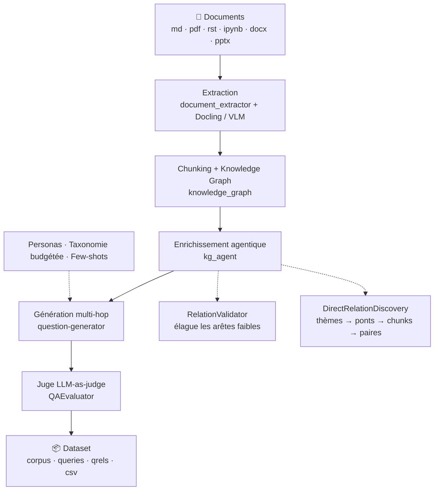

<div align="center">

# STARK

**Synthetic Training And RAG Knowledge**

Générateur de datasets Q/R synthétiques **multi-hop** pour l'évaluation et le fine-tuning de systèmes RAG.
Vous donnez une documentation technique — STARK rend un benchmark annoté, scoré et prêt à l'emploi.

[](https://www.python.org/)
[](https://github.com/explodinggradients/ragas)
[](https://fastapi.tiangolo.com/)
[](https://streamlit.io/)
[](https://github.com/DS4SD/docling)
[](#-ce-que-stark-produit)
[](LICENSE)

**Français** · [English](README.en.md)

[Démarrage rapide](#-démarrage-rapide) · [Comment ça marche](#-comment-ça-marche) · [Configuration](#-configuration) · [Sorties](#-ce-que-stark-produit) · [Documentation](#-documentation)

</div>

---

## Le problème

Évaluer un système RAG demande un jeu de questions/réponses de référence. Or :

- les datasets publics ne parlent pas de **votre** domaine ;
- annoter à la main coûte des jours d'expert ;
- les générateurs naïfs produisent des questions **mono-chunk**, auxquelles un simple `grep` répond — elles ne mesurent donc rien de la capacité de raisonnement du RAG.

## La réponse de STARK

STARK construit un **graphe de connaissances** de votre corpus (nœuds = chunks, arêtes = relations sémantiques), puis ne génère des questions que sur des **paires de chunks réellement connectées**. Chaque question exige donc deux sauts de raisonnement — et un juge LLM vérifie ensuite qu'elle n'est pas répondable depuis un seul contexte.

```
❌ Générateur naïf     « Que fait la méthode extend_3d ? »            → 1 chunk suffit
✅ STARK               « Quelles données aérodynamiques doivent être  → 2 chunks requis
                         disponibles avant d'appeler extend_3d, et
                         pourquoi le mode diffère-t-il entre rotor
                         et stator ? »
```

---

## ✨ Fonctionnalités clés

| | |
|---|---|
| 🕸️ **Génération guidée par graphe** | Chunking respectant les titres et les blocs de code, relations `cosine`, `shared_keyphrase`, `next_chunk`, `same_document` |
| 🤖 **Enrichissement agentique du KG** | Un `RelationValidator` élague les arêtes faibles ; un pipeline de 4 agents découvre les ponts **inter-documents** que la similarité seule ne voit pas — sans parcours O(n²) |
| ⚖️ **Juge LLM intégré** | Chaque paire Q/R est scorée sur 3 critères (*groundedness*, *accuracy*, *two-hop necessity*) via `logprobs`, avec seuil de rejet configurable |
| 🎭 **Personas & taxonomie budgétée** | Les types de questions suivent un budget cible (30 % intégration, 20 % comparaison…) : plus de dataset déséquilibré |
| 🧠 **Auto-configuration par agent** | Décrivez votre corpus en 3 lignes : un agent LLM en 8 étapes construit la taxonomie, les personas, tous les prompts et les few-shots |
| 📦 **Sorties standard** | BEIR (`corpus` / `queries` / `qrels`) + CSV d'inspection + KG sérialisé |
| 💾 **Reprise sur incident** | Checkpoint après chaque question : une génération interrompue repart où elle s'est arrêtée |
| 🔬 **Ablation en une commande** | `make compare` lance 4 configurations et mesure l'apport réel de chaque outil |
| 🖥️ **CLI, API et UI** | Runner en ligne de commande, API REST FastAPI et interface Streamlit sur le même cœur |

---

## 🔭 Comment ça marche



Chaque étape est pilotée par une **`PipelineConfig`** : un unique fichier YAML par session qui contient les prompts, les personas, la taxonomie, les seuils de scoring et les paramètres de chunking. Aucun prompt n'est codé en dur.

---

## 🚀 Démarrage rapide

### 1. Installation

```bash
git clone https://github.com/Ibrahim-bel/stark.git
cd stark
pip install -r requirements.txt      # ou : make install
```

> Python ≥ 3.10 recommandé. L'installation embarque `torch` et les modèles Docling : prévoyez de la place et un environnement virtuel dédié.

### 2. Configuration

```bash
cp .env.example .env
```

Le minimum vital dans `.env` :

```bash
OPENAI_API_KEY=sk-...
OPENAI_BASE_URL=https://api.openai.com/v1   # ou votre proxy / endpoint compatible
OPENAI_MODEL=gpt-4o                          # modèle de génération
SCORING_MODEL=gpt-4.1-mini                   # ⚠️ doit supporter logprobs → modèle GPT
EMBEDDING_API_KEY=sk-...
EMBEDDING_BASE_URL=https://api.openai.com/v1
EMBEDDING_MODEL=text-embedding-3-small
INPUT_DIR=./docs                             # votre corpus
OUTPUT_DIR=./src/output/my_run               # où écrire le dataset
```

### 3. Votre corpus

Le dossier `docs/` n'est pas versionné : déposez-y vos propres documents (ou faites pointer `INPUT_DIR` ailleurs).

```bash
mkdir -p docs && cp -r /chemin/vers/ma_doc/*.md docs/
```

### 4. Premier run

```bash
make run-dry          # ⏱️ test en 2 questions — valide la config de bout en bout
make run N=50         # génération réelle
```

Le dataset atterrit dans `OUTPUT_DIR`. Ouvrez `dataset.csv` pour une inspection humaine immédiate.

---

## 🛠️ Les trois modes d'utilisation

<table>
<tr><th>Mode</th><th>Pour qui</th><th>Commande</th></tr>
<tr>
<td><b>CLI</b></td>
<td>Runs reproductibles, CI, batch</td>
<td><code>make run N=100</code></td>
</tr>
<tr>
<td><b>API REST</b></td>
<td>Intégration dans vos outils</td>
<td><code>make server</code> → <code>:8080</code></td>
</tr>
<tr>
<td><b>Interface web</b></td>
<td>Exploration, revue des Q/R, édition des prompts</td>
<td><code>make stark</code> → <code>:8501</code></td>
</tr>
</table>

### Toutes les commandes CLI

```bash
make run                     # run selon pipeline/cosapp_v1.yaml (N=10 par défaut)
make run N=100               # override du nombre de questions
make run-dry                 # test rapide, 2 questions
make run EXTRA="--no-discover --input-dir ./mes_docs"
make compare N=50            # 4 runs d'ablation (voir plus bas)
make server                  # API FastAPI  — port 8080
make stark                   # UI Streamlit — port 8501
```

Priorité de configuration : **flags CLI > `cosapp_v1.yaml` > `.env` > valeurs par défaut**.

### API REST (extrait)

| Méthode | Route | Description |
|---|---|---|
| `POST` | `/api/sessions` | Créer une session |
| `POST` | `/api/sessions/{id}/auto-configure` | Générer la config par agent LLM |
| `POST` | `/api/sessions/{id}/dry-run` | Valider la config (2 triplets) |
| `POST` | `/api/sessions/{id}/generate` | Lancer un job de génération |
| `GET` | `/api/sessions/{id}/jobs/{job_id}` | Suivre l'avancement (`stage`, `pct`) |
| `GET` | `/api/sessions/{id}/results/{job_id}` | Télécharger le dataset |

→ Liste complète dans [PIPELINE.md § 14](PIPELINE.md).

---

## 🔧 Configuration

Une session = un fichier YAML. [`pipeline/cosapp_v1.yaml`](pipeline/cosapp_v1.yaml) sert d'exemple complet et de référence.

### Activer / désactiver les outils

```yaml
tools:
  vlm: false                  # extraction visuelle des PDF (modèle vision)
  cosine_relations: false     # relations par similarité cosinus
  keyphrase_relations: false  # relations par keyphrases partagées
  validate_relations: true    # KG Agent — élagage des relations faibles
  discover_relations: true    # KG Agent — nouvelles relations inter-documents
  qa_eval: false              # juge LLM-as-judge
  dry_run: false              # mode test, 2 questions
```

### Restreindre la génération

```yaml
filters:                      # null = tout utiliser
  taxonomy: [implementation, comparison]
  personas: ["CoSApp Developer"]
  lengths:  [long, medium]    # long | medium | short
  styles:   [perfect_grammar] # perfect_grammar | web_search_like | misspelled | poor_grammar
```

### Taxonomie budgétée

Le budget garantit la diversité : à chaque question, STARK choisit le type le plus **sous-représenté** parmi ceux compatibles avec la paire de chunks.

| Type | Budget | Ce que la question demande |
|---|---:|---|
| `integration` | 30 % | Comment deux éléments interagissent (flux de données, ports, équations) |
| `comparison` | 20 % | Ce qui oppose deux classes, modes ou approches |
| `design_rationale` | 20 % | **Pourquoi** un choix de conception a été fait |
| `implementation` | 15 % | **Comment** utiliser ou configurer, en croisant les deux segments |
| `enumeration` | 10 % | Une liste d'étapes, ports ou conditions assemblée depuis les deux |
| `factual` | 5 % | Une valeur, un type ou un nom déterminable seulement en croisant |

> Le budget doit sommer à `1.0` — validé par Pydantic au chargement, et renormalisé automatiquement si un filtre restreint la taxonomie.

### Auto-configuration

Pas envie d'écrire 900 lignes de YAML ? Décrivez votre corpus dans l'UI (ou via `POST /auto-configure`) : un agent LLM en 8 étapes analyse le corpus, dessine la taxonomie, invente les personas, rédige tous les prompts, génère les few-shots, puis valide le tout. Comptez 3 à 5 minutes en mode qualité.

---

## 📦 Ce que STARK produit

```
OUTPUT_DIR/
├── dataset.json                  # dataset complet + traçabilité (tools_used, filters_used)
├── corpus.jsonl                  # BEIR — les chunks sources
├── queries.jsonl                 # BEIR — les questions
├── qrels.jsonl                   # BEIR — question → chunks pertinents
├── dataset.csv                   # vue tabulaire pour inspection humaine
├── knowledge_graph.json          # KG sérialisé (nœuds, arêtes, embeddings)
└── questions_checkpoint.json     # reprise après interruption
```

**`dataset.csv`** — une ligne par question, avec ses deux contextes, son type, son persona et ses scores :

| `question` | `answer` | `context_1` | `context_2` | `question_type` | `persona` | `qa_groundedness` | `qa_accuracy` | `qa_two_hop` | `qa_overall` |
|---|---|---|---|---|---|---|---|---|---|

Le triplet BEIR se branche directement sur les évaluateurs RAG existants (RAGAS, BEIR, `ir_datasets`…).

---

## 🔬 Mesurer l'apport de chaque outil

Chaque brique du pipeline a un coût en tokens. STARK permet de vérifier qu'elle le vaut :

```bash
make compare N=50
```

| Run | `validate` | `discover` | `qa_eval` | Sortie |
|---|:--:|:--:|:--:|---|
| `run_base` | ✗ | ✗ | ✗ | `src/output/compare/run_base/` |
| `run_validate` | ✓ | ✗ | ✗ | `src/output/compare/run_validate/` |
| `run_discover` | ✗ | ✓ | ✗ | `src/output/compare/run_discover/` |
| `run_full` | ✓ | ✓ | ✓ | `src/output/compare/run_full/` |

Comparez les `dataset.csv` produits pour arbitrer coût / qualité sur **votre** corpus.

---

## 📁 Structure du dépôt

```
stark/
├── pipeline/
│   ├── main.py                 # runner CLI — point d'entrée
│   ├── cosapp_v1.yaml          # config de session complète + tools/filters
│   ├── base/                   # ré-export des composants toujours actifs
│   └── tools/                  # ré-export des composants optionnels
│
├── src/
│   ├── pipeline_config.py      # schéma Pydantic v2 de toute la configuration
│   ├── config_agent.py         # agent LLM 8 étapes d'auto-configuration
│   ├── document_extractor.py   # extraction (+ docling_client, document_preprocessor)
│   ├── knowledge_graph.py      # chunking + construction du KG
│   ├── kg_agent.py             # RelationValidator + DirectRelationDiscovery
│   ├── question-generator.py   # synthèse multi-hop + QAEvaluator
│   ├── question_type_budget.py # allocation budgétaire des types de questions
│   ├── personas.py             # personas par défaut
│   ├── session_manager.py      # CRUD des sessions YAML
│   ├── job_runner.py           # orchestration asynchrone des jobs
│   ├── server.py               # API FastAPI
│   └── stark_app.py            # interface Streamlit
│
├── docs/                       # votre corpus (non versionné)
└── tests/                      # tests pytest
```

---

## 🧪 Tests

```bash
pytest                 # suite complète
pytest -v              # détaillé
pytest tests/test_split_generation.py
```

---

## 📚 Documentation

| Document | Contenu |
|---|---|
| **[PIPELINE.md](PIPELINE.md)** | Le pipeline étape par étape : algorithmes, prompts, formats de sortie, API, UI |
| **[STARK_PIPELINE_AGENT.md](STARK_PIPELINE_AGENT.md)** | Référence développeur : interfaces des modules, schéma de config, variables d'environnement, glossaire, pièges connus |
| **[pipeline/cosapp_v1.yaml](pipeline/cosapp_v1.yaml)** | Session complète commentée, à copier comme point de départ |

---

## ⚠️ Bon à savoir

- **`SCORING_MODEL` doit être un modèle GPT.** Le juge QA s'appuie sur `logprobs=True`, que Claude et la plupart des modèles open-source ne renvoient pas. Le modèle de *génération* (`OPENAI_MODEL`), lui, est libre.
- **N'importez jamais `question-generator` directement** (le tiret est invalide en Python) : passez par `from question_generator import QuestionGenerator`.
- **Le KG est construit en RAM.** Au-delà de ~200 documents, prévoyez plusieurs Go ; `STARK_KG_STORE_DIR` met les embeddings en cache entre les runs.
- **Interruption = reprise.** Relancer la même commande repart de `questions_checkpoint.json`. Pour repartir de zéro, supprimez-le.
- **Derrière un proxy d'entreprise** avec certificat auto-signé : `OPENAI_VERIFY_SSL=false`.
- **`tools:` / `filters:` ne sont lus que par le runner CLI** (`pipeline/main.py`) et ignorés par `PipelineConfig` : ce sont deux systèmes de contrôle indépendants du mode API.

---

## 🗺️ Glossaire express

| Terme | Définition |
|---|---|
| **chunk** | Fragment de document, nœud du graphe |
| **triplet** | `(chunk_A, chunk_B, relation)` — l'unité de base d'une question |
| **1-hop / 2-hop** | Les deux chunks d'un triplet : A puis B |
| **bridge theme** | Thème technique présent dans ≥ 2 documents, servant de pont inter-docs |
| **persona** | Profil utilisateur fictif qui oriente l'angle et le style des questions |
| **budget** | Proportions cibles des types de questions (somme = 1.0) |
| **BEIR** | Format standard d'évaluation RAG : `corpus` + `queries` + `qrels` |

Glossaire complet dans [STARK_PIPELINE_AGENT.md § 13](STARK_PIPELINE_AGENT.md).

---

## 📄 Licence

STARK est distribué sous licence **[Apache 2.0](LICENSE)**.

Vous êtes libre de l'utiliser, le modifier et le redistribuer, y compris à des
fins commerciales. La licence inclut une **concession de brevet explicite** et
demande, en contrepartie, de conserver la mention de copyright et de signaler
les fichiers que vous avez modifiés.

```
Copyright 2026 Ibrahim Belayachi
Licensed under the Apache License, Version 2.0
```

---

## 🙏 Bâti sur

[RAGAS](https://github.com/explodinggradients/ragas) · [Docling](https://github.com/DS4SD/docling) · [LangChain](https://github.com/langchain-ai/langchain) · [Pydantic](https://github.com/pydantic/pydantic) · [FastAPI](https://github.com/fastapi/fastapi) · [Streamlit](https://github.com/streamlit/streamlit)

<div align="center">
<sub>Une question, une idée ? Ouvrez une <a href="https://github.com/Ibrahim-bel/stark/issues">issue</a>.</sub>
</div>
